# Amazon Sidekick — AI-Powered Shopping Assistant

> **Amazon HackOn Season 6** submission — An intelligent shopping assistant embedded in Amazon Now that builds smart grocery carts through natural language, image uploads, recipes, occasions, emergency kits, and healthcare templates.

**Live Demo:** [amazon-hackon-6.vercel.app](https://amazon-hackon-6.vercel.app/)

---

## Table of Contents

1. [Project Overview](#project-overview)
2. [System Architecture](#system-architecture)
3. [Tech Stack](#tech-stack)
4. [Database Schema](#database-schema)
5. [Component Architecture](#component-architecture)
6. [User Flows & Sequence Diagrams](#user-flows--sequence-diagrams)
7. [Three-Tier Cart System](#three-tier-cart-system)
8. [Features](#features)
9. [Project Structure](#project-structure)
10. [Setup & Installation](#setup--installation)
11. [Environment Variables](#environment-variables)
12. [API Reference](#api-reference)
13. [Deployment](#deployment)

---

## Project Overview

**Amazon Sidekick** is a conversational AI assistant built directly into the Amazon Now shopping experience. Instead of browsing products manually, users describe what they need — a recipe, a party plan, an emergency kit, or a health requirement — and Sidekick intelligently builds a shopping cart from Amazon's product catalog.

### Core Innovation: Three-Tier Cart Pipeline

```
User Request → AI Analysis → Mini Cart → User Review → Sidekick Cart → Checkout → Amazon Cart
```

Each tier gives users transparency and control before committing to a purchase.

### Sidekick Workspace

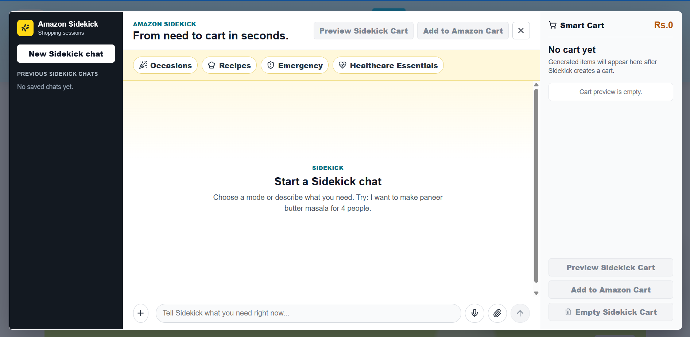

---

## System Architecture

### High-Level System Architecture

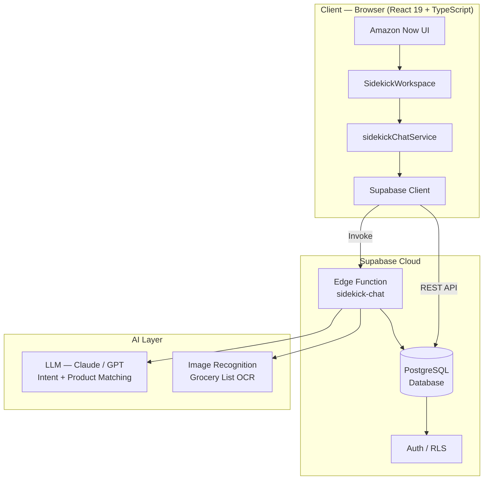

### Deployment Architecture

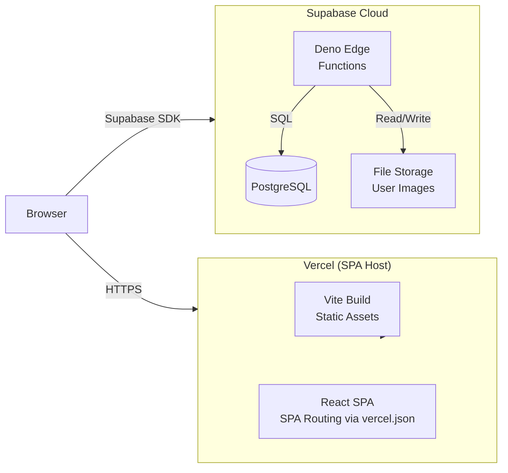

---

## Tech Stack

| Layer | Technology | Version |
|---|---|---|
| UI Framework | React | 19.0.0 |
| Language | TypeScript | 5.7.2 |
| Build Tool | Vite | 6.0.5 |
| Routing | React Router DOM | 7.1.1 |
| Icons | Lucide React | 0.468.0 |
| Backend / DB | Supabase (PostgreSQL) | 2.108.2 |
| Serverless Functions | Supabase Edge Functions (Deno) | — |
| Hosting | Vercel | — |
| AI/LLM | Claude / GPT (via Edge Function) | — |

---

## Database Schema

### Entity-Relationship Diagram

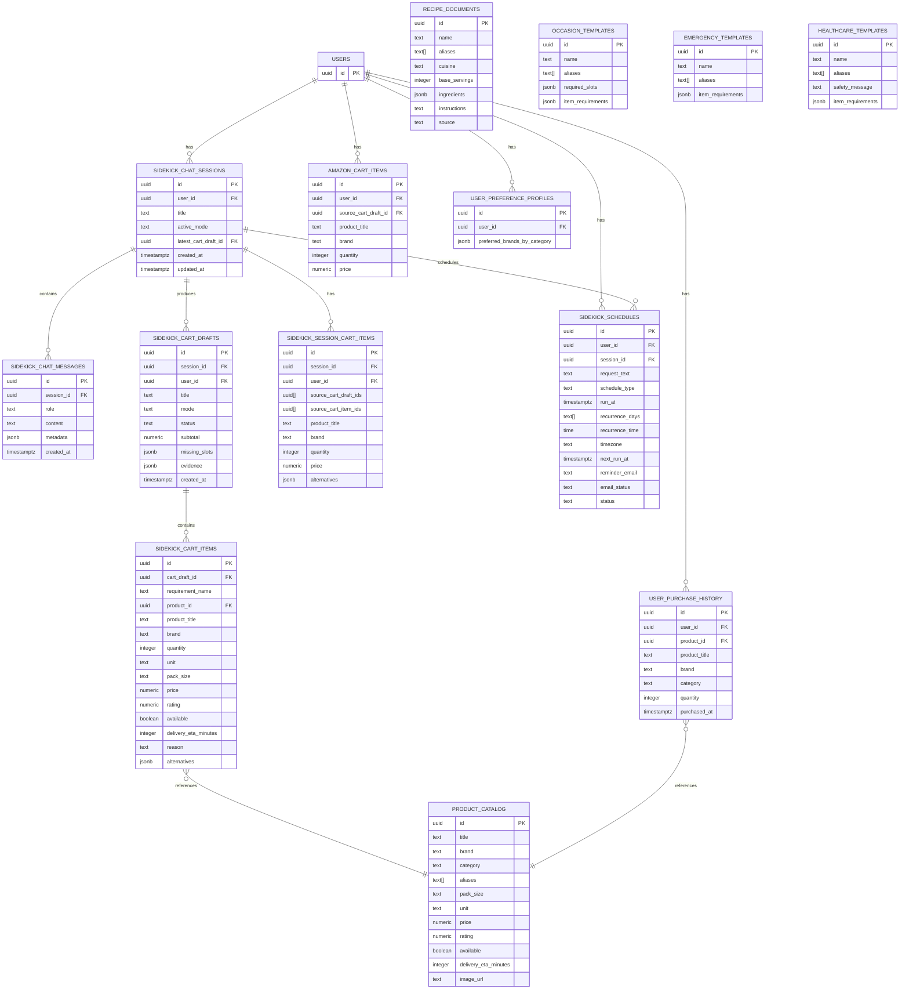

### Cart Status State Machine

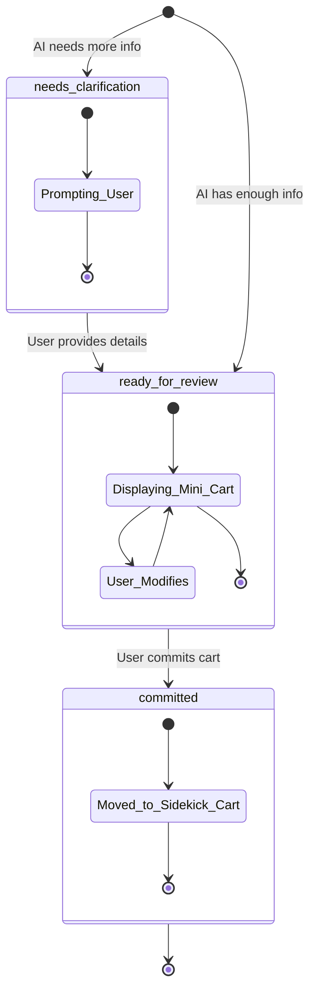

---

## Component Architecture

### React Component Tree (UML Class-Style)

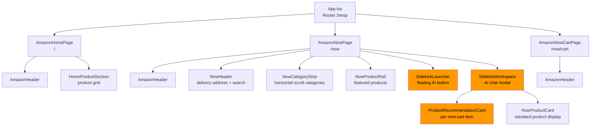

### SidekickWorkspace State Machine

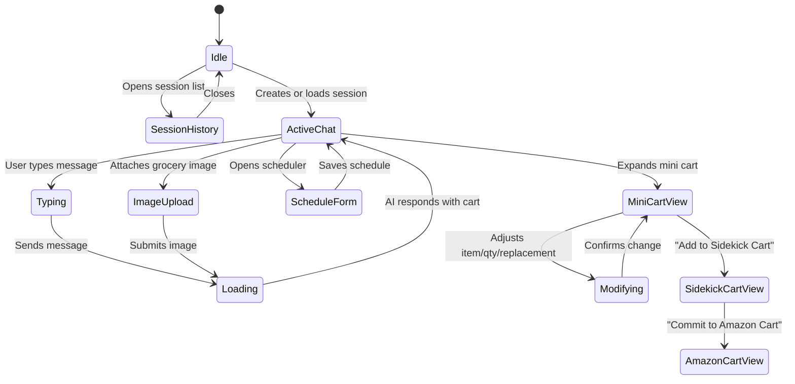

---

## User Flows & Sequence Diagrams

### Flow 1: Recipe-Based Shopping

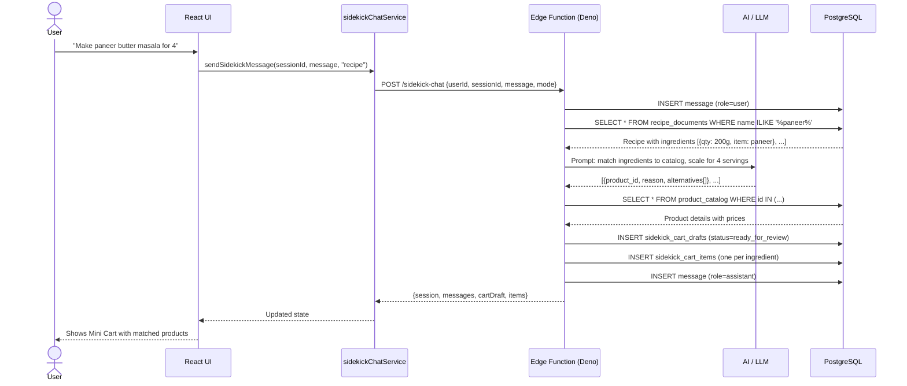

### Flow 2: Image-Based Grocery List

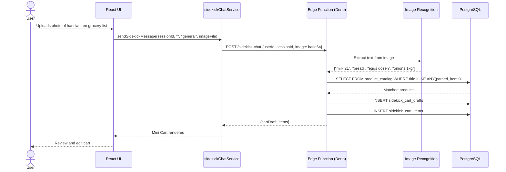

### Flow 3: Three-Tier Cart Commit Flow

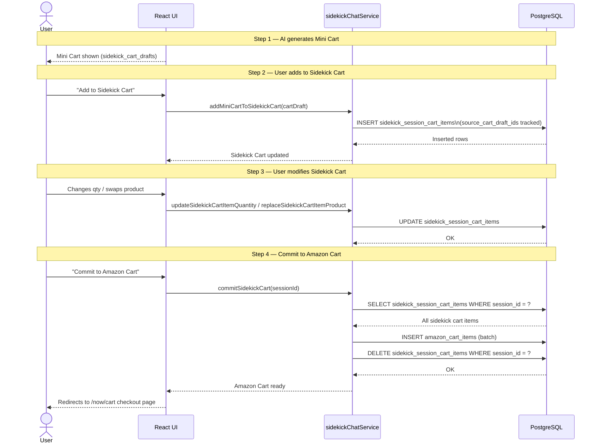

### Flow 4: Scheduled Orders

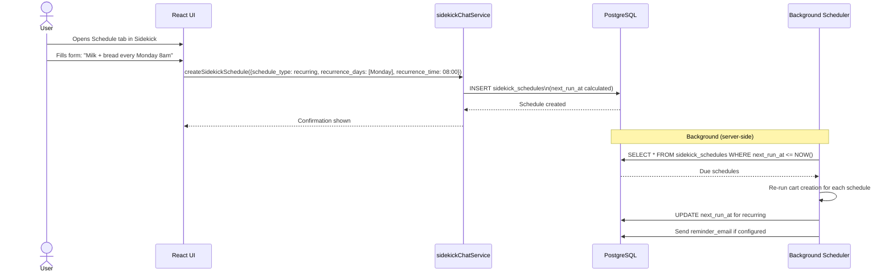

---

## Three-Tier Cart System

This is the core innovation of Amazon Sidekick. Each tier serves a distinct purpose:

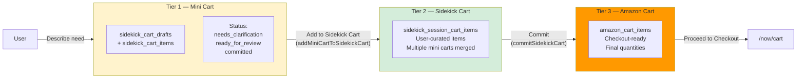

| Tier | Table | User Can Modify | Purpose |
|------|-------|-----------------|---------|
| Mini Cart | `sidekick_cart_drafts` + `sidekick_cart_items` | Qty, swap product | AI-generated first draft |
| Sidekick Cart | `sidekick_session_cart_items` | Qty, swap, remove | User-curated across multiple requests |
| Amazon Cart | `amazon_cart_items` | Read-only (checkout) | Final committed cart |

---

## Features

### Sidekick Modes

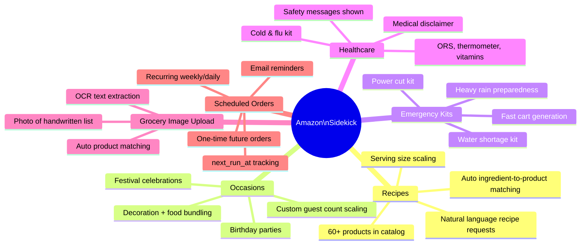

### Input Methods

| Method | Description |
|--------|-------------|
| Text Chat | Natural language message to Sidekick |
| Voice Input | Browser speech recognition API |
| Image Upload | Photo of grocery list parsed via OCR |
| Mode Buttons | Quick-launch Recipes / Occasions / Emergency / Healthcare |
| Schedule Form | Date/time/recurrence picker for future orders |

---

## Project Structure

```
amazon-hackon-6/
├── src/
│   ├── pages/
│   │   ├── AmazonHomePage.tsx       # Landing page (route: /)
│   │   ├── AmazonNowPage.tsx        # Shopping page (route: /now)
│   │   └── AmazonNowCartPage.tsx    # Checkout page (route: /now/cart)
│   ├── components/
│   │   ├── AmazonHeader.tsx         # Top navigation bar
│   │   ├── HomeProductSection.tsx   # Home page product grid
│   │   ├── NowCategoryStrip.tsx     # Horizontal category nav
│   │   ├── NowHeader.tsx            # Amazon Now header
│   │   ├── NowProductCard.tsx       # Individual product card
│   │   ├── NowProductRail.tsx       # Horizontal product scroll
│   │   ├── ProductRecommendationCard.tsx  # AI-recommended item card
│   │   ├── SearchBar.tsx            # Search input
│   │   ├── SidekickLauncher.tsx     # Floating Sidekick button
│   │   └── SidekickWorkspace.tsx    # Main AI chat modal (~1834 lines)
│   ├── services/
│   │   └── sidekickChatService.ts   # All Supabase operations
│   ├── data/
│   │   ├── amazonHomeData.ts        # Home page static data
│   │   ├── amazonNowData.ts         # Categories and featured products
│   │   └── sidekickUiData.ts        # Sidekick modes config
│   ├── lib/
│   │   └── supabaseClient.ts        # Supabase client init
│   ├── styles/
│   │   ├── global.css
│   │   ├── amazon-home.css
│   │   ├── amazon-now.css
│   │   └── sidekick.css
│   ├── App.tsx                      # Router configuration
│   └── main.tsx                     # React entry point
├── supabase/
│   ├── functions/
│   │   └── sidekick-chat/           # Deno Edge Function (AI backend)
│   ├── schema.sql                   # Full database schema
│   ├── schedule_schema.sql          # Scheduling table schema
│   ├── seed_recipe_mvp.sql          # 60+ products + templates
│   └── migrations/                  # Database migrations
├── scripts/
│   └── seedRecipeMvp.mjs            # Node.js seed script
├── public/
│   └── sidekick/                    # UI assets
├── .env.example                     # Environment variable template
├── index.html                       # HTML entry point
├── package.json
├── tsconfig.json
├── vite.config.ts
└── vercel.json                      # SPA routing rewrites
```

---

## Setup & Installation

### Prerequisites

- Node.js 18+
- A [Supabase](https://supabase.com) account and project
- (Optional) Vercel account for deployment

### 1. Clone and install

```bash
git clone <repo-url>
cd amazon-hackon-6
npm install
```

### 2. Configure Supabase

Create a Supabase project, then copy your project URL and anon key:

```bash
cp .env.example .env
# Edit .env with your values
```

### 3. Set up the database

Run the SQL files in order in the Supabase SQL editor:

```sql
-- 1. Main schema
-- Run: supabase/schema.sql

-- 2. Scheduling schema
-- Run: supabase/schedule_schema.sql

-- 3. Seed data (products, recipes, templates)
-- Run: supabase/seed_recipe_mvp.sql
```

Or use the seed script:

```bash
npm run seed:recipe
```

### 4. Deploy the Edge Function

```bash
npx supabase functions deploy sidekick-chat
```

### 5. Run the development server

```bash
npm run dev
```

The app will be available at `http://localhost:5173`.

---

## Environment Variables

Create a `.env` file at the project root:

```env
VITE_SUPABASE_URL=https://your-project-id.supabase.co
VITE_SUPABASE_ANON_KEY=your-supabase-anon-public-key
```

| Variable | Description | Required |
|----------|-------------|----------|
| `VITE_SUPABASE_URL` | Supabase project REST URL | Yes |
| `VITE_SUPABASE_ANON_KEY` | Supabase anonymous public key | Yes |

---

## API Reference

All data operations go through `src/services/sidekickChatService.ts` which wraps the Supabase JS client.

### Sessions

| Function | Description |
|----------|-------------|
| `listSidekickSessions(userId)` | List all sessions for a user |
| `createSidekickSession(userId)` | Create a new chat session |
| `loadSidekickSession(sessionId)` | Load session with messages and latest cart |
| `deleteSidekickSession(sessionId)` | Delete a session |

### Messaging

| Function | Description |
|----------|-------------|
| `sendSidekickMessage(params)` | Send message to AI (calls Edge Function) |

### Mini Cart (Tier 1)

| Function | Description |
|----------|-------------|
| `loadCartDraft(cartDraftId)` | Load a mini cart with all items |
| `updateCartItemQuantity(itemId, qty)` | Change item quantity |
| `removeCartItem(itemId)` | Remove item from mini cart |
| `replaceCartItemProduct(itemId, product)` | Swap to alternative product |

### Sidekick Cart (Tier 2)

| Function | Description |
|----------|-------------|
| `loadSidekickSessionCart(sessionId)` | Get all items in Sidekick Cart |
| `addMiniCartToSidekickCart(cartDraft)` | Promote mini cart to Sidekick Cart |
| `updateSidekickCartItemQuantity(itemId, qty)` | Update quantity |
| `removeSidekickCartItem(itemId)` | Remove item |
| `replaceSidekickCartItemProduct(itemId, product)` | Swap product |
| `emptySidekickCart(sessionId)` | Clear entire Sidekick Cart |

### Amazon Cart (Tier 3)

| Function | Description |
|----------|-------------|
| `listAmazonCartItems(userId)` | Get final Amazon Cart |
| `commitSidekickCart(sessionId)` | Move Sidekick Cart → Amazon Cart |

### Scheduling

| Function | Description |
|----------|-------------|
| `createSidekickSchedule(params)` | Create one-time or recurring order |

### Edge Function: `POST /sidekick-chat`

```json
{
  "userId": "uuid",
  "sessionId": "uuid",
  "message": "Make paneer butter masala for 4 people",
  "selectedMode": "recipe",
  "image": "base64string (optional)"
}
```

**Response:**
```json
{
  "session": { "id": "...", "title": "..." },
  "messages": [...],
  "cartDraft": { "id": "...", "status": "ready_for_review", "subtotal": 245.50 },
  "sidekickCartItems": [...]
}
```

---

## Deployment

### Vercel (Frontend)

The `vercel.json` configures SPA routing so all paths resolve to `index.html`:

```json
{
  "rewrites": [{ "source": "/(.*)", "destination": "/" }]
}
```

**Deployed at:** [https://amazon-hackon-6.vercel.app/](https://amazon-hackon-6.vercel.app/)

Deploy with:

```bash
npm run build
vercel --prod
```

### Supabase (Backend)

- Database: Managed PostgreSQL, always-on
- Edge Functions: Deployed to Supabase's global Deno runtime
- RLS: Disabled for MVP; enable per-table policies before production

---

## Hackathon Context

This project was built for **Amazon HackOn Season 6**. The core thesis is that AI can dramatically reduce the friction of online grocery shopping by:

1. Understanding **intent** (recipe, emergency, occasion) not just product names
2. **Building a complete cart** from a single natural language request
3. Keeping the user **in control** via the three-tier review pipeline
4. Supporting **multiple input modalities** (text, voice, image)
5. Enabling **repeat ordering** via intelligent scheduling

---

*Built with React 19, TypeScript, Supabase, and Vite. Deployed on Vercel.*
